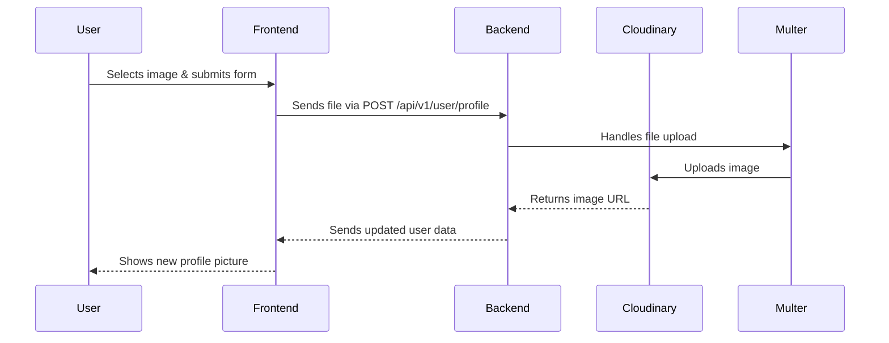

# 🚀 Last-Pass: Secure Password Manager

Welcome to **Last-Pass** – your open-source, full-stack password manager!  
This app makes it easy to securely store, manage, and retrieve your passwords with a modern web experience.

---
# 🧑‍💻 Build With

## 🌟 Features at a Glance

- **🔐 User Authentication**  
  Register, login, and logout — all secured with JWT tokens and bcrypt password hashing.

- **🗄️ Password Vault**  
  Store your secrets (like passwords or notes) in a personal vault.  
  Easily add or remove entries – your data, your control!

- **🖼️ Profile Picture Upload**  
  Upload a profile photo using a simple form!  
  Powered by [Multer](https://github.com/expressjs/multer) for file handling and [Cloudinary](https://cloudinary.com/) for secure, fast image storage.

- **🌩️ Cloud Storage**  
  All uploaded images are stored on Cloudinary, ensuring speed and reliability.

- **📲 RESTful API**  
  Built with best practices for scalability and security.

- **⚛️ Modern Frontend**  
  A beautiful, responsive UI built using **React** and **TailwindCSS**.

---

## 🛠️ Technologies Used

| Layer     | Tech Stack                        | Purpose                                |
|-----------|-----------------------------------|----------------------------------------|
| Backend   | Node.js, Express.js, MongoDB      | API, server logic, data storage        |
| ORM       | Mongoose                          | MongoDB modeling & queries             |
| Security  | JWT, bcrypt, dotenv               | Auth, password hashing, config         |
| File Upload | Multer, Cloudinary              | User profile images, cloud storage     |
| Frontend  | React, Vite, TailwindCSS          | UI/UX, fast dev build                  |
| Utilities | cookie-parser, cors               | Cookie management, cross-origin access |

---

## 💡 Example: Uploading a Profile Picture

1. **Navigate to your profile page.**
2. **Select an image file** using the "Choose File" button.
3. **Click "Upload"** – your picture will be processed by Multer and securely stored on Cloudinary.
4. **See your new avatar instantly!**

---

## 🔥 What Makes Last-Pass Cool?

- Your secrets are always **encrypted at rest**.
- **Seamless user experience**: Fast, modern, and mobile-ready.
- **Open-source**: Fork it, improve it, use it your way!

---

## 🏁 Next Steps

- Try registering a new account.
- Add a few passwords to your vault.
- Upload a custom profile photo.
- Log out and see how your session is protected.

---

## 👀 Want to Learn More?

- [Explore the code on GitHub](https://github.com/havker02/Last-Pass)
---

> Made with ❤️ using Node.js, React, and all the latest web tech!
